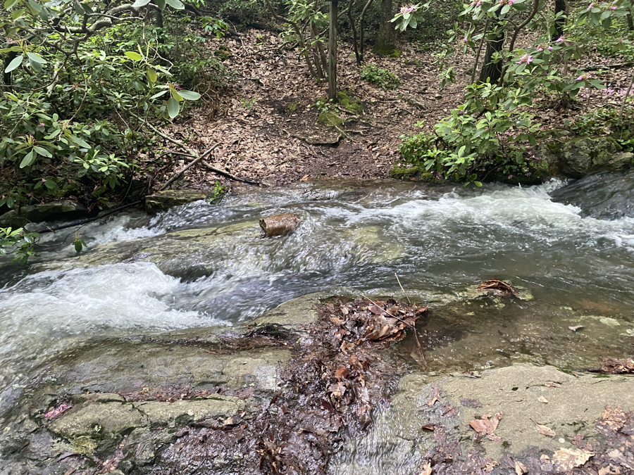
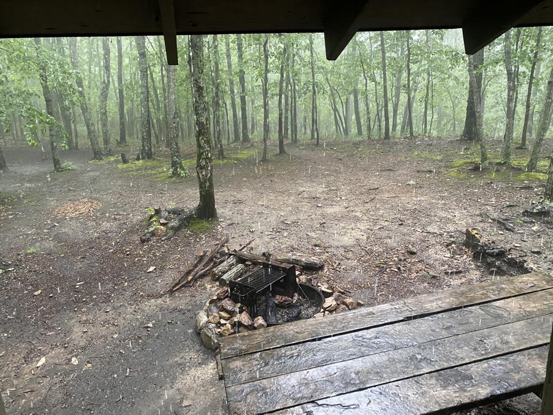

| Miles hiked | Elevation gain (ft.) | AT mile |
| ----------- | -------------- | -------- |
| 11.08 | 3,028 | 741.5 |

## Memorable moments from today
- Chill morning at the Super 8 in Daleville. I waited out the rain in the morning and left around noon.
- The first mile or so ran parallel to some highway. It felt out of place walking through trees but hearing the sounds of cars piercing through.
- I passed by a telephone pole with a sign saying I was 1/3 of the way to Katahdin! Only 2/3rds to go.
- The sun was out and the sky was blue, something that I hadn't seen in days! It was a pleasant day to be hiking.
- There were a couple of crazy streams that were in overdrive from last night's rain. I managed to keep my feet dry crossing them. That was until the last one where I promptly fell on my ass and got soaked. I dropped one of my trekking poles and had to run down the stream to get it back.
- I made it to the shelter right before a massive rain cell moved in. Dionysus was the only one that got there before me. It started absolutely pouring. I was glad that I had the shelter over my head.
- Everyone else came in, not so lucky with the whole staying dry thing.
- I cooked some of the nice ramen that I got yesterday for dinner and then called it a night.

<figcaption>Stream crossing where I fell and got soaked</figcaption>

<figcaption>Waiting out the rain in the shelter</figcaption>