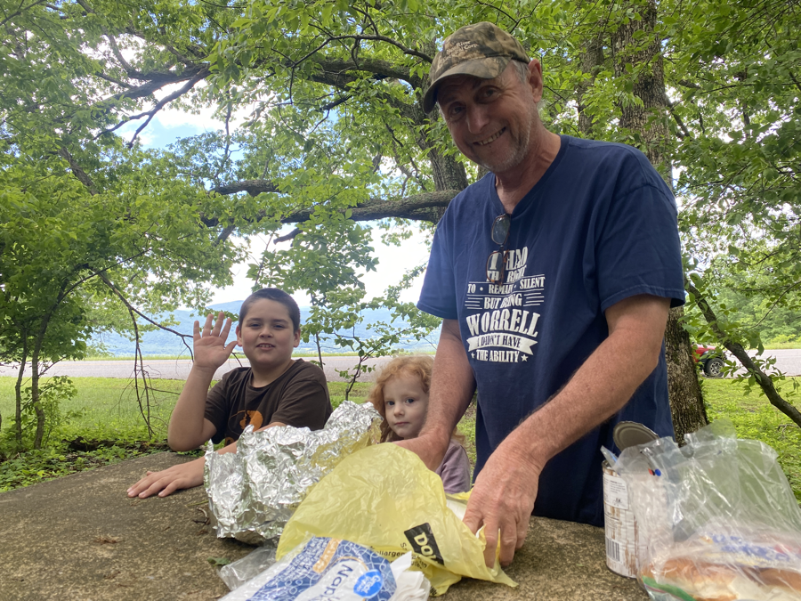

| Miles hiked | Elevation gain (ft.) | AT mile |
| ----------- | -------------- | -------- |
| 21.30 | 4,376 | 762.3 |

## Memorable moments from today
- The trail ran parallel to the Blue Ridge Parkway for the first part of today. The Blue Ridge Parkway is a long stretch of road with great views that goes all the way from Smoky Mountain National Park to Shenandoah National Park.
- A man named Gary and his grandchildren were having a picnic at a table by the Blue Ridge Parkway. They invited me over to join and I gladly accepted. He gave me fried chicken, beans, bread, and a cold Coke!
- There was more trail magic a couple miles later at VA 614. I met Lumberjack and Crocka there. We agreed to hike the 4 miles up to Bryant Ridge Shelter, walk a 0.7 mile side trail to a parking area, and call a shuttle to Middle Creek Campground, which offers burgers and a resupply.
- The shuttle, a pickup truck, came and we hopped in the bed. The lady driving had a joy ride getting us to the campground. It was exhilarating and frightening at the same time.
- We all got cheeseburgers at the campground, which tasted amazing. We got our resupply and hopped back in the pickup truck bed to go back to the shelter.
- We met everyone else at the shelter. Bryant Ridge Shelter is by far the best shelter I've seen on trail so far. It's a two floor shelter with a huge amount of space and a porch. There were 10 hikers there and we had plenty of space.
- Crocka brought ingredients for s'mores. We built a fire, toasted marshmallows, and enjoyed the s'mores to finish off the day.

<figcaption>View of Taylor Mountain from the Blue Ridge Parkway</figcaption>

<figcaption>Large stone wall along the trail</figcaption>

<figcaption>Sign on the Blue Ridge Parkway about the AT</figcaption>

<figcaption>Spontaneous trail magic from Gary and his grandchildren</figcaption>

<figcaption>Double cheeseburger at Middle Creek Campground</figcaption>

<figcaption>Our shuttle back to the trail</figcaption>

<figcaption>Bryant Ridge Shelter</figcaption>