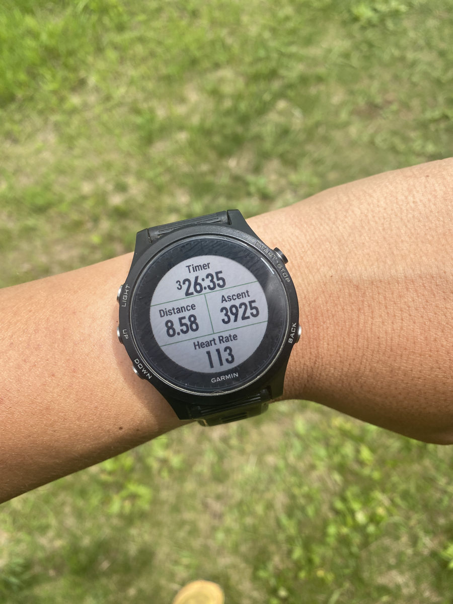
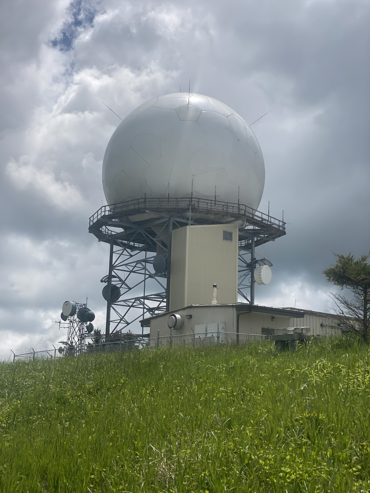
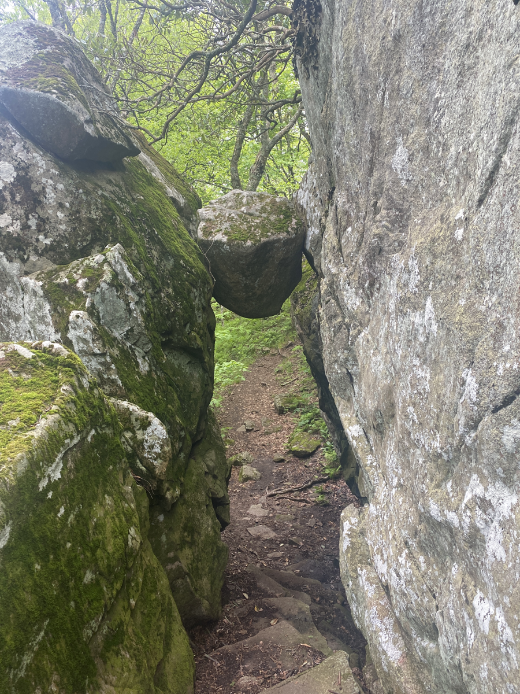

| Miles hiked | Elevation gain (ft.) | AT mile |
| ----------- | -------------- | -------- |
| 22.34 | 5,814 | 785.1 |

## Memorable moments from today
- Left around 8:30 this morning and made good time to Thunder Ridge Outlook where I had lunch. The climb in the first eight miles was challenging. Over 4,000 ft of elevation gain.
- Pickles and Banquet came up to Thunder Ridge for lunch as I was eating. We talked about our plan for a zero (and potentially double zero) at Banquet's place in Fredericksburg.
- I was pretty drowsy in the afternoon, so I took a nap at a parking lot. The nap rejuvenated me and I was able to hike the last eight miles to Matt's Creek Shelter.
- I bought some "cheese" from Middle Creek Campground yesterday to put in my ramen for dinner. I put cheese in quotation marks because I'm not sure if it's legally cheese or not. The packaging says "imitation pasteurized cheese food" and the first two ingredients are water and soybean oil. Regardless, my hiker hunger was strong enough to where I thought it made a tasty addition to my dinner of ramen with sun dried tomatoes and fried onions. I'll look for real cheese next time I shop.

<figcaption>Long and steep climb at the beginning of the day</figcaption>

<figcaption>Weather radar station at the top of Apple Orchard Mountain</figcaption>

<figcaption>The guillotine</figcaption>