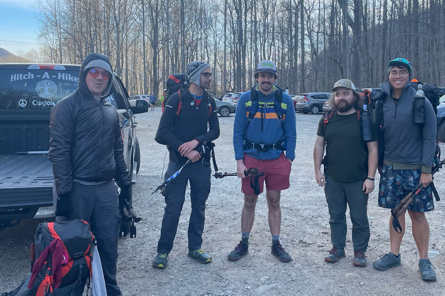
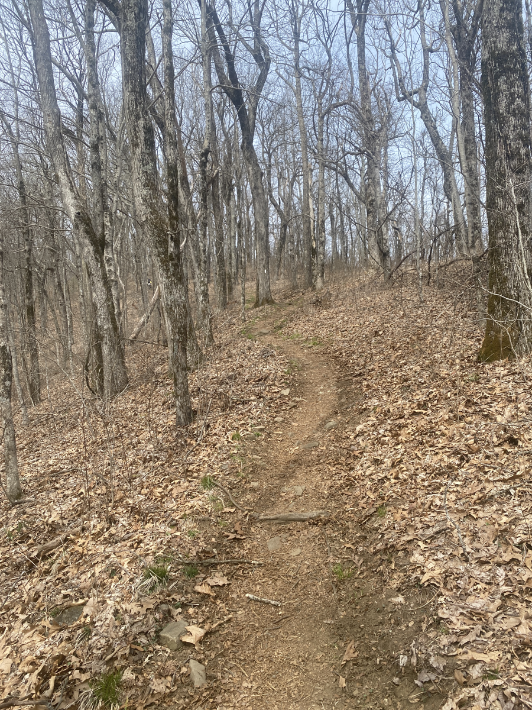
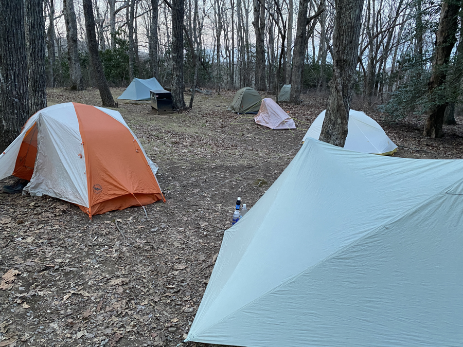

| Miles hiked | Elevation gain (ft.) | AT mile |
| ----------- | -------------- | -------- |
| 12.93 | 4,373 | 65.6 |

I'm pretty tired at the end of the day writing this post. It was a pretty hard day in terms of hiking. My foot was still swollen this morning, but I was able to put weight on it and walk. Our shuttle driver picked us up at 9 and brought us back to Unicoi Gap. She took a picture of us and we were on our way back on the AT.

<figcaption>Left to right: Yugi, Pickles, Jack (no trail name yet), Strings, me</figcaption>

Today's hike had a **lot** of uphill climbs. It was my first 4,000+ ft elevation gain day. My foot was bothering me, but it didn't hurt enough for me to stop for the day or take any painkillers. It was more of an annoyance with every left step. I did find myself taking breaks more often to rest my legs against a tree and let my feet drain a bit, which helped somewhat.

I found my foot taking a lot of my attention, and I was going at a slower pace than I usually have been. I put in my earbuds, for the first time since starting the AT, and listened to some music and podcasts to bring my attention to something else. I got through three Big Bootie Mixes and two episodes of the Philosophize This podcast before I finally found myself at camp.

<figcaption>The trail just loves going up</figcaption>

I got to the shelter, which was moderately full, but not packed. I was able to set up my tent, cook dinner around the shelter, and socialize with everyone there for the night. That brought my spirits up from the hard hike that I had earlier in the day. Virtually all of us were headed into Hiawassee tomorrow to escape the rain. We spent a lot of time talking about the food that we were planning on eating, especially the buffet in town.

I spent a good amount of time propping my feet up trying to reduce the swelling. I also set my backpack under the foot of my sleeping pad to elevate my feet for the night. Hopefully that will help things out tomorrow morning for the hike into Dick's Creek gap into Hiawassee. I'm really looking forward to that buffet tomorrow.