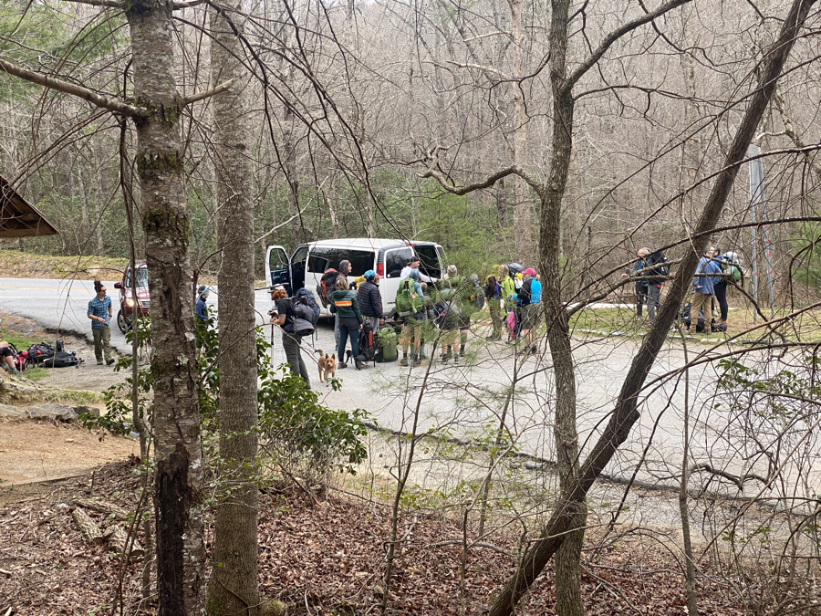
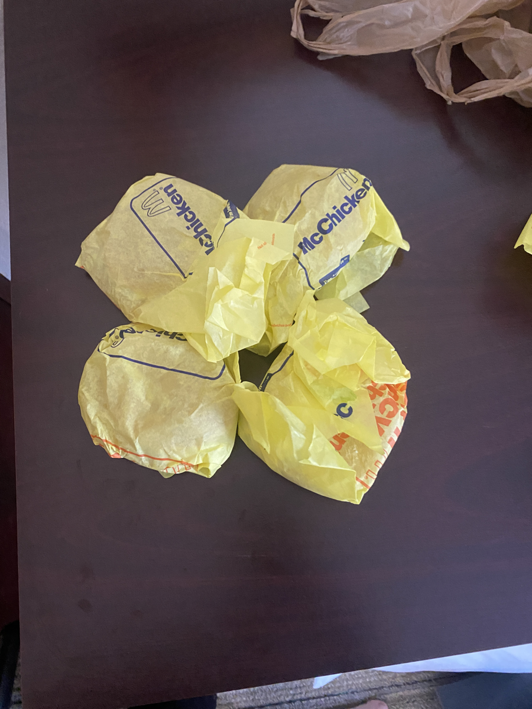

| Miles hiked | Elevation gain (ft.) | AT mile |
| ----------- | -------------- | -------- |
| 3.73 | 751 | 69.2 |

I woke up with the sun around 7:20 today. It felt good knowing that today was a nice easy day to get into Hiawassee. Waiting for us in Hiawassee was an all-you-can-eat buffet, a nice warm shower, and a roof over our heads to avoid the heavy rain for the day.

I made quick work packing my stuff, tearing down my tent, eating breakfast, and getting on the trail. My feet felt a lot less swollen than yesterday. I found myself almost back to my normal hiking pace. It was a short hour and a half to get to Dick's Creek Gap, where our shuttle would pick us up. It was a damn party at Dick's Creek gap when I got there. I'm pretty sure every hiker nearby had the same idea of heading into town to avoid the rain.

I sat down at a picnic table and talked with some other hikers, mostly about what we wanted to eat, but some other stuff as well. Our shuttle driver came and we all piled in.

It was a short ride into Hiawassee. It's a small town with one main street about a mile long. We got dropped off at our hotel and were luckily able to check in early. We set our bags in our room and headed off to the buffet just across the street.

The buffet, Daniel's Steak House, which for some reason is both a buffet and a steak house, had a bunch of fried chicken and pork. The other offerings were a bit scarce, but I made sure I ate as much meat as I could (pictured above). I had to make sure I got my moneys worth. I also made sure to include a plate of vegetables at the end to make sure that I don't get scurvy. It's a great feeling knowing that I get to eat as much food as I want and not have to climb up a hill right after.

After that we headed to the nearby grocery store to resupply. It was a pretty par for the course American grocery store, so I can't complain about the food selection. I got a bunch of Knorr pasta sides, tuna, ramen, peanut butter, oatmeal, and all kinds of bars to eat while hiking. 

There was a random guy at the grocery store who asked me if I was hiking the AT. I told him yes and we had a small conversation. He ended up asking me "If I was an Asian", which I responded "Why yes sir I am". I might have been the first Asian person this guy has seen this decade. I'm sure that this town doesn't get all that much of them. I try to approach these situations with the notion that the other person comes from a place of ignorance/curiosity rather than malice.

After that we got back to the hotel and just relaxed for the rest of the day. I spent as much time propping my feet up as I could. For dinner I got 4 McChickens from the nearby McDonalds.

It was really nice not having to hike through the heavy rain today. Tomorrow I plan on crossing the Georgia-North Carolina border! First state will be out of the way. Only 13 more to go!