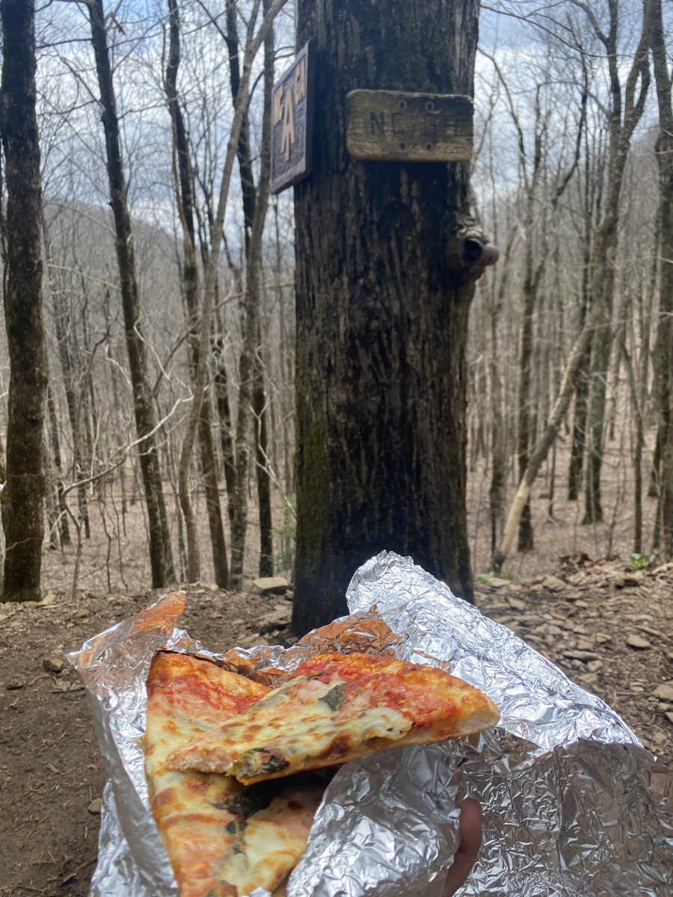
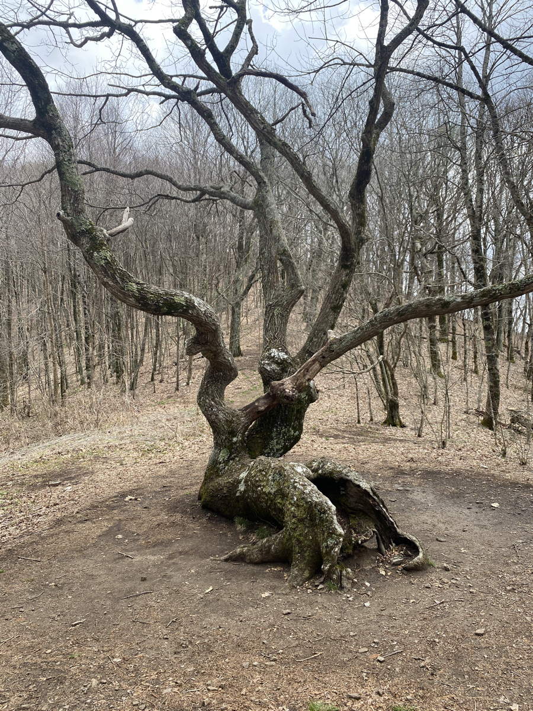
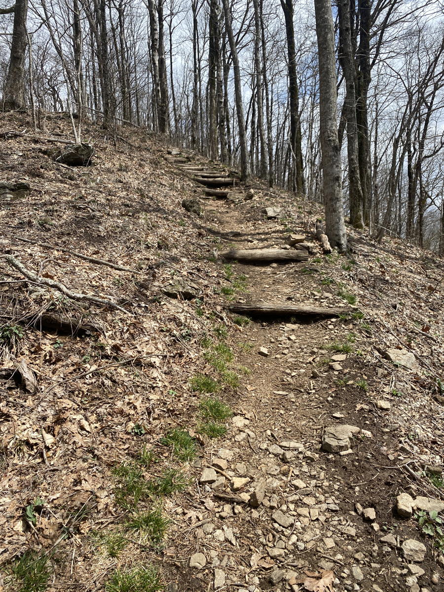

| Miles hiked | Elevation gain (ft.) | AT mile |
| ----------- | -------------- | -------- |
| 11.41 | 4,298 | 81.0 |

There are some things that you start appreciating when you sleep in a hotel after backpacking. Not having to shimmy on your shoes, put on your headlamp, and crawl out of your tent to pee in the middle of the cold night is one of them. You can just get out of bed, walk to the restroom, use it, and get back under the sheets in a nice climate-controlled room.

I woke up around 7:30 today. Our shuttle was coming to the hotel at 9, so I had plenty of time to go eat breakfast and pack my things. At breakfast some other hikers came and offered us two leftover pizzas. I got some aluminum foil and packed out 4 slices in my pack.

All the food that I bought yesterday for my 3-4 days into Franklin, NC made my pack so much heavier. The pizza probably added a solid pound as well. In total my pack was about 10 lbs heavier than it had been coming into Hiawassee. 

Our shuttle dropped us off back at Dick's Creek gap and we made our way back on the AT. It was a warm and humid day. I found my shirt pretty much soaked in sweat just a half hour into my hike. Not to mention that today had about 4,200 ft. of elevation gain. Needless to say I was making sure I was getting as much electrolytes as I could in my water.

I met up with Jack a little bit into the day and we matched paces. We made conversation during the hike and it helped to take our minds off all the damn uphills that we were doing. Before we knew it we made it to the Georgia/North Carolina border! 1 state down, only 13 more to go. We sat down at the border and ate some of our packed out pizza. 

An older hiker, Circuit Rider, came by and took my picture for me with the border sign (pictured above).

<figcaption>Interesting tree right after the border</figcaption>

We continued on from the border and were immediately hit with some crazy uphill inclines. In addition to going up forever, the trail got _steep_. 

We slowly made our ways up, step by step. I had to stop looking up because every time I did, I was daunted by how much more uphill I had to go.

Eventually we finally made it to the shelter for the night, Muskrat Creek. Since it looks like it's going to rain tonight, I was hoping that there would be some space in the shelter. Unfortunately, it was already filled up with other hikers by the time we got there.

We still had a good amount of daylight left so we leisurely set up our tents and ate food. Everyone else came in a bit after us.

Yugi decided to pack out an entire bottle of wine from Hiawassee. It was a spiced wine that was meant to be served warm. The entire thing must have weighed at least 5 pounds. He warmed it up in his pot, added some spices he had, and shared it with the rest of us. It was a seriously good wine, kind of like a cider. 

We suggested the name Dionysus to him. He was never really into the name Yugi (he got it because he used to play Yu-Gi-Oh professionally), so he decided to go with Dionysus.

After that, we went through the pain-in-the-ass process of hanging our food bags. North Carolina doesn't have bear boxes at their shelters, so I'm going to have to get very used to hanging my food bag from now on.

The sun set quickly after that so we all headed to our tents for the night. It's going to rain a little tonight. As I lay in my tent typing this, there's a bit of lightning and some rain hitting my tent. This is actually my first night sleeping in my tent with rain, so hopefully nothing seriously goes wrong and my gear stays dry!

Today was pretty physically hard, but the swelling in my feet has pretty much disappeared for now. Looking at tomorrow, I'm planning on going either 12 or 16 miles. I'll see how my body feels throughout the day and gauge it off that. Til then, I'll let the sound of the rain drift me off to sleep.