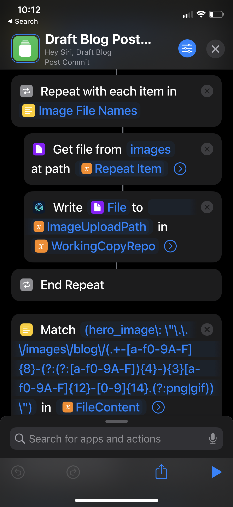

<figcaption>That sweet, sweet Lighthouse score</figcaption>

I see this site as a reflection of my growth in the field of web development. I initially created this site in 2019. My first version was a templated WordPress site. It got the job done, but it felt a bit uninspired and generic. I then taught myself React along with other web dev tools and used a Gatsby template for my next version. Earlier this year, I wanted to completely rebuild this site from scratch without any prior templates, and with specific functionality for my upcoming Appalachian Trail thru-hike. This is what I wanted:

- Fast load times with minimal JavaScript usage
- A map that could track my progress along the Appalachian Trail
- Utilization of Markdown files as the source for my content
- The ability to write and publish posts from my phone in an asynchrounous manner (cell phone reception along the Appalachian Trail is spotty)
- Non-reliance on any paid hosting

To achieve fast loading times with free hosting, I knew that a using a static site generator would be the best option. GitHub with its [Actions](https://github.com/features/actions) and [Pages](https://pages.github.com/) utilities provided a free, simple build and hosting pipeline.

Next was chosing a static site generator to use. These were the following SSGs I considered using:

- [Next.js](https://nextjs.org/)
- [Gatsby](https://www.gatsbyjs.com/)
- [Hugo](https://gohugo.io/)
- [11ty](https://www.11ty.dev/)
- [Astro](https://astro.build/)

In the end, I decided to go with Gatsby. Gatsby offers multiple plug-ins for features like responsive image processing that made getting that fast performance I wanted a lot easier on my end. Gatsby also uses GraphQL, which was a query language I wanted to learn. As well, I had prior experience with Gatsby and React, which allowed me to develop the site at a more efficient pace.

Because my site is only a handful of pages and blog posts, build times weren't a huge consideration. I also didn't need any server side rendering. Other frameworks like Hugo and Next.js are better in these domains. But since I don't forsee myself needing fast build times or server side rendering in the future, I chose Gatsby due to the aforementioned benefits.

I also decided to use [Tailwind CSS](https://tailwindcss.com/). I heard a lot of positive things about Tailwind online. I've never used a utility-first CSS framework like Tailwind, and at first glance, I was a bit appalled at the monstorous class names like `absolute top-0 right-0 m-0 p-0 flex-col items-start bg-slate-900 text-left list-none`. However, it only took me about an hour to realize just how much _faster_ my workflow had become. Instead of jumping around CSS files, I was able to quickly define exactly what I wanted.

A big feature I wanted to implement was the map of my progress on the Appalachian Trail. I wanted there to be markers on the map that corresponded with where I ended up at the end of each day. For the mapping library, I stumbled upon [React Simple Maps](https://www.react-simple-maps.io/), which renders maps as a simple SVG instead of relying on an exernal service like Google Maps or MapBox. This reduces both the load time on my site and my reliance on external services.

All pages and blog posts on this site are written in Markdown and saved as [`.mdx`](https://mdxjs.com/) files, which lets me directly insert React components into any of my posts (like my map).

Gatsby lets me insert frontmatter into my Markdown files, which provides metadata that I can use. I set up an iOS Shortcut which pings my location, and pastes the longitude and latitude into the frontmatter.

```
---
date: "2022-03-29"
title: "Day 1"
hero_image: "../images/blog/archway.jpg"
longitude: -84.1939
latitude: 34.6272
---
```

<figcaption>Example frontmatter from shortcut</figcaption>

I can then query all the coordinates of my blog posts with the underlying GraphQL infrastructure that Gatsby provides.

```
query {
    allMdx(filter: { fileAbsolutePath: { regex: "/.+/posts/.+/" } }) {
        edges {
            node {
            id
            frontmatter {
                longitude
                latitude
                title
            }
            slug
            }
        }
    }
}
```

<figcaption>
  The GraphQL query I used to get the longitude and latitude of all of my blog
  posts
</figcaption>

With this list of coordinates, I can provide them to my map, which renders the markers with their corresponding blog links.

I needed the ability to write and publish all my posts from my phone, as that is the only device I'll have with me on my Appalachian Trail thru-hike. I give most credit to [Scott Willsey](https://scottwillsey.com/), who so graciously introduced me to his mobile blog writing and publishing workflow, using the apps [Drafts](https://getdrafts.com/) and [Working Copy](https://workingcopyapp.com/), along with some [crazy iOS Shortcuts](https://scottwillsey.com/blog/ios/draftsworkflow/) to stitch everything together. With this, I'm able to write posts and upload images offline, commit them to my Git repo, then push everything once I get cell phone reception. For more intricate details on this workflow, take a look at Scott's blog.



<figcaption>
  {" "}
  The absolute madness of the iOS Shortcut to commit this blog post (it has 73 steps!)
</figcaption>

Every time I push a change to my repo for this site, GitHub automatically runs the build process and dumps the output static files onto its own CDN. The only money I need to spend on an annual basis is for my domain name hosting and the pro version of Drafts which lets me integrate the iOS shortcuts.

Through the process of rebuilding this site, I learned and utilized a lot of interesting tools. I found it extremely rewarding to build something from the ground up. Hopefully nothing major breaks during my thru-hike!
