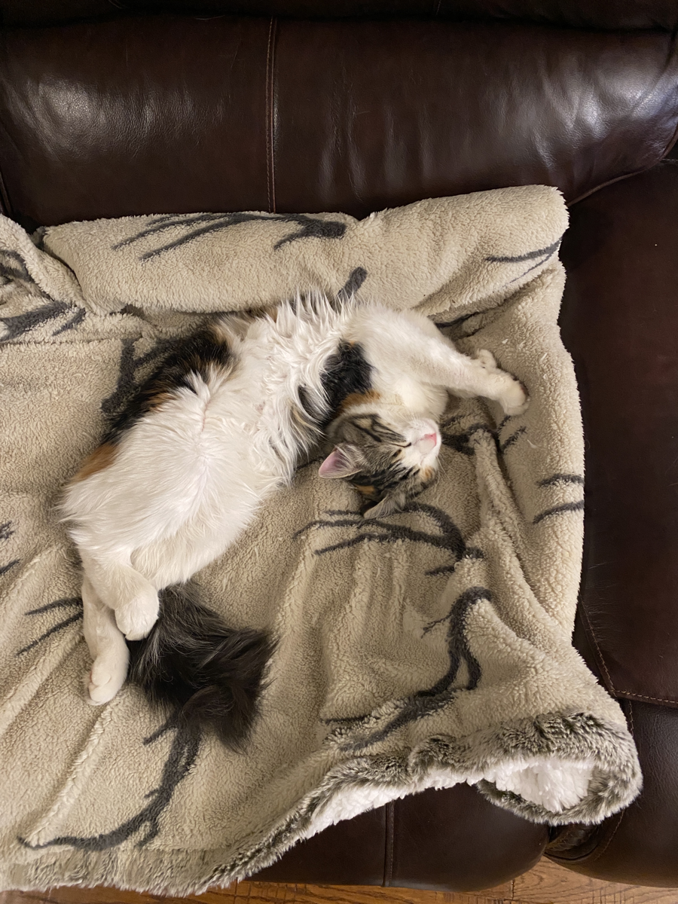

I wrote this blog post completely on my phone! I used [Drafts](https://getdrafts.com) and [Working Copy](https://workingcopyapp.com) along with iOS Shortcuts to commit and push my markdown file and associated images. On pushing these changes to this sites [GitHub repo](https://github.com/forbesye/forbesye.github.io), a GitHub action automatically runs to build and publish this site!

I'll write another post about the rest of the tech I used to build this site.

Huge, huge thanks to [Scott Willsey](https://scottwillsey.com) for providing me with the Drafts actions and shortcuts that allowed me to do this workflow on my phone. Being able to write blog posts offline will be extremely helpful when I'm hiking the Appalachian Trail. I seriously wouldn't have been able to get this done without his help.

Here's another cat picture of 小龙:

